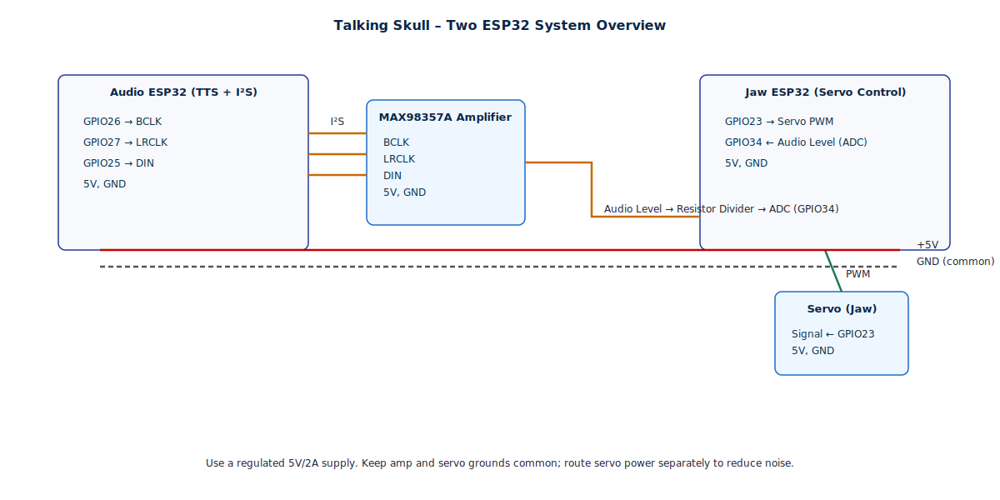

Here’s your **cleaned GitHub-ready `README.md`** — all YAML code blocks have been removed for a sleeker, non-technical presentation while keeping every section, image, and reference intact:

---

```markdown
# 🧠 Talking Skull Project (ESPHome + Audio-Reactive Jaw)

### Interactive Halloween Skull with Moving Jaw Synced to TTS or Audio

This project brings the classic “Talking Skull” prop to life using **ESP32 boards**, **ESPHome**, and **audio-reactive servo control**.  
It’s based on the original **JawDuino** concept by Mike (Arduino + KA2284 LED sound meter) and has been **modernized** for ESPHome, allowing wireless control, TTS integration, and synchronization with Home Assistant.

---

## 🧩 Overview

Two ESP32 devices work together:

| Device | Role | Description |
|---------|------|-------------|
| **ESP32 #1 (Audio)** | Audio/TTS playback | Plays TTS or MP3 files using a MAX98357A I²S amplifier. |
| **ESP32 #2 (Jaw Control)** | Servo motion | Moves the skull’s jaw in sync with sound amplitude captured from the audio line. |

Audio output and control signals are shared between them through a safe resistor divider.

---

## 📁 Repository Structure

```

/TalkingSkull/
│
├── JawDuino.ino              # Original Arduino reference
├── SoftRcPulseOut.cpp/.h     # Custom servo pulse library (used by JawDuino)
├── jawduino.pdf              # Original build notes and wiring
│
├── esphome-web-3a75c8.yaml   # ESPHome Skull TTS (Audio ESP32)
├── esphome-testdevice.yaml   # ESPHome Jaw Servo (Motion ESP32)
│
└── README.md                 # This documentation

```

---

## ⚙️ YAML File Descriptions

### 🎙️ `esphome-web-3a75c8.yaml` — Audio/TTS Controller

Handles text-to-speech playback and streams audio to the MAX98357A amplifier.

**Key Features:**
- I²S audio output via GPIO26 (BCLK), GPIO27 (LRCLK), GPIO25 (DIN)
- Works as a Home Assistant `media_player`
- Accepts local MP3/WAV playback or HA TTS commands
- Syncs audio level signal to the jaw controller via resistor divider line

---

### 🦴 `esphome-testdevice.yaml` — Jaw Servo Controller

Controls the jaw servo based on the incoming audio amplitude.

**Key Features:**
- Reads analog input (ADC) corresponding to audio amplitude
- Smoothly moves the jaw servo proportionally to loudness
- Allows testing and calibration modes through switches
- Integrates with Home Assistant for manual control and diagnostics

---

## 🧰 Custom Component: `SoftRcPulseOut`

Originally written by **RC Navy**, this library provides **software-based servo pulse control** with reduced jitter — an alternative to the standard `Servo` library.  
While the ESPHome version uses hardware PWM, the original Arduino version used this for smooth analog servo movement.

**Features:**
- Microsecond precision for servo pulse width  
- Handles multiple software-generated PWM outputs  
- Compatible with low-resource microcontrollers (e.g., ATtiny85)

---

## 🔌 Wiring Diagrams

### 🖥 System Overview


### 🧾 Detailed Wiring


---

## 🔋 Powering Everything

Use a **regulated 5V power supply** rated for at least **2A**:
- Servos can draw large transient currents.
- Both ESP32s and MAX98357A share the 5V rail.
- Use separate ground wires for audio and servo power to reduce noise.

If using USB:
- Power Audio ESP32 via USB.
- Power Jaw ESP32 via VIN with 5V directly.
- Ensure **common ground** across both boards.

---

## 🧠 Calibration & Tuning

1. **Start with the jaw servo disconnected.**
2. Use the ESPHome dashboard to monitor the `jaw_audio_level` sensor.
3. Adjust the resistor divider or amplifier output for a dynamic range between **0.1V and 1.5V**.
4. Connect the jaw servo and fine-tune the servo movement range:
   - Modify servo `min_angle` / `max_angle` parameters.
   - Optionally create switches for **Jaw 25%, 50%, 75%, 100% test moves**.
5. Verify the jaw moves smoothly with speech and rests quietly between words.

---

## 🧩 Integrations

| Integration | Purpose |
|--------------|----------|
| **Home Assistant** | Send TTS or MP3 files for playback |
| **ESPHome API** | Wireless control and synchronization |
| **Node-RED (optional)** | Create reactive flows for speech and motion |
| **Alexa Media Player** | Play TTS through the skull |

---

## ⚠️ Troubleshooting

| Issue | Cause | Solution |
|-------|--------|----------|
| Scratchy audio | Shared ground loop or missing resistor divider | Add isolation resistors; verify common ground |
| Jaw buzzes at rest | Servo holding torque too high | Add dead-band or relax servo after idle |
| No jaw motion | Wrong ADC pin or scaling | Check analog wiring and calibration |
| Servo jitter | Power noise from audio amp | Add decoupling capacitors and separate grounds |

---

## 📜 Credits

- **Original Concept:** Mike’s *JawDuino* ([jawduino.pdf](jawduino.pdf))  
- **Servo Library:** *SoftRcPulseOut* by RC Navy  
- **ESPHome Conversion:** Adapted and modernized by **Paul Goldstein**  
- **Audio Playback:** MAX98357A via I²S Audio integration  

---

## 🧰 Future Enhancements

- Add microphone-based auto calibration  
- Include RGB LED eyes synchronized to speech  
- Add PIR motion trigger and idle animation  
- Create a Home Assistant dashboard for TTS input and skull control  

---

## 📄 License

This project is shared under the **MIT License**.  
Feel free to fork, modify, and improve — just credit the original creators.

---

**👻 Bring your Halloween props to life — now fully wireless, TTS-enabled, and synced to the sound of your voice.**
```

---

Would you like me to include clickable GitHub image paths (like `/assets/talking-skull-overview.svg`) so it displays properly when uploaded to your repo?
